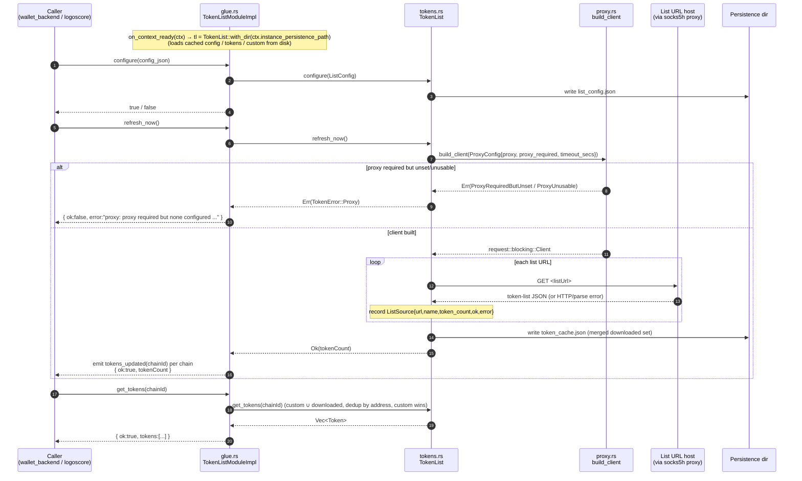

# `logos-evm-token-list-module` — Reference Specification

## Purpose

`logos-evm-token-list-module` is the **token-list provider** for the Logos
multi-chain EVM wallet. It downloads, parses, and **merges** one or more
[Uniswap token-lists](https://github.com/Uniswap/token-lists) together with a
per-user **custom** list, deduplicated **per chain** by token address, and serves
the merged set to the rest of the wallet on demand. The token metadata it serves
(`chainId`, `address`, `name`, `symbol`, `decimals`, `logoURI`) is what the wallet
uses to recognise ERC-20 tokens, render them in the UI, and drive balance / price
lookups elsewhere.

Every outbound download is built through a single **fail-closed proxy chokepoint**
(`src/proxy.rs`), the same privacy primitive used by `eth_rpc_module`. When a proxy
is *required* but none is usable, the module **refuses to fetch in the clear**
rather than leaking the request — list fetches are therefore proxyable / Tor-ready
by construction.

The module is a **Rust cdylib Logos module** (rust-first authoring). The public
API is the set of methods on the `TokenListModule` trait (`rust-lib/src/glue.rs`),
which the Logos module builder turns into the module's IPC contract (`.lidl`) and
its generated transport glue.

### Where this repo sits in the EVM wallet

```
logos-evm-wallet-ui            (universal C++ ui_qml app — tabs incl. Market)
        │  drives over the Logos bridge
        ▼
logos-evm-wallet-backend-module   (coordinator / tx builder)
        │  calls token_list_module.get_tokens / get_all_tokens / add_custom_token …
        ▼
┌──────────────────────────────────────────────────────────────┐
│  THIS REPO — logos-evm-token-list-module (token_list_module)  │
│    • download + parse + merge Uniswap token-lists             │
│    • per-chain dedup, user custom list                        │
│    • fail-closed fetch via vendored net-proxy chokepoint      │
└──────────────────────────────────────────────────────────────┘
        │  HTTP GET each list URL
        ▼
   net-proxy (vendored)  ──►  socks5h:// proxy (Tor)  ──►  token-list hosts
```

It is a **leaf module**: it has **no Logos-module dependencies** of its own
(`metadata.json → "dependencies": []`). Its only network dependency is the
**vendored `net-proxy` chokepoint** (`src/proxy.rs`), an inlined copy of the
canonical `logos-net-proxy` crate. Callers (chiefly `wallet_backend_module`, and
ultimately `wallet-ui`) drive it; it does not call other modules.

---

## Overall architecture

```mermaid
flowchart TB
    subgraph caller["Caller (wallet_backend_module / logoscore)"]
        RPC["invokeRemoteMethod / logoscore call\n(token_list_module.<method>)"]
    end

    RPC -->|Logos transport| GLUE

    subgraph module["token_list_module (Rust cdylib)"]
        direction TB
        GLUE["glue.rs\nTokenListModule trait impl\n(TokenListModuleImpl)\n+ generated provider_gen.rs\n+ logos_module_install()"]
        STATE["TokenListModuleImpl\n{ tl: Option&lt;TokenList&gt; }\nlazily built on_context_ready"]
        CORE["tokens.rs — TokenList core\nconfig · sources · downloaded · custom\n(persisted dir)"]
        PROXY["proxy.rs — net-proxy chokepoint\nbuild_client(ProxyConfig)\nfail-closed"]
        EVT["TokenListModuleEvents\nemit_tokens_updated(chainId)"]

        GLUE --> STATE
        STATE --> CORE
        CORE -->|refresh_now builds the ONLY HTTP client| PROXY
        GLUE -.emits.-> EVT
    end

    PROXY -->|reqwest::blocking GET via socks5h proxy| NET[("List URLs\n(Uniswap token-lists hosts)")]
    CORE -->|read/write JSON| DISK[("instance persistence dir\nlist_config.json\ntoken_cache.json\ncustom_tokens.json")]
    EVT -.->|tokens_updated(chainId)| caller
```

**Internal structure**

| Layer | File | Responsibility |
|-------|------|----------------|
| **Glue / transport** | `rust-lib/src/glue.rs` | Defines the `TokenListModule` IPC trait + `TokenListModuleEvents`; `include!`s the build-time `generated/provider_gen.rs` (provides `RustModuleContext`, `install::<T>()`, `emit_tokens_updated`); marshals JSON in/out; `logos_module_install()` entry point. |
| **State** | `glue.rs` `TokenListModuleImpl` | Holds `tl: Option<TokenList>`. The `TokenList` is created lazily in `on_context_ready` once the runtime hands over the per-instance persistence path. Before that, methods return a `"context not ready"` error. |
| **Core logic** | `rust-lib/src/tokens.rs` | The pure (Logos-free) `TokenList`: configuration, fetch+parse+merge, per-chain dedup, custom list, persistence. Unit-tested with `cargo test --no-default-features`. |
| **Network chokepoint** | `rust-lib/src/proxy.rs` | Vendored `net-proxy`. `build_client(&ProxyConfig)` is the **only** `reqwest` client constructor in the crate; fails closed when a proxy is required but unusable. |
| **Events** | `glue.rs` | `tokens_updated(chainId)` emitted per affected chain after a successful refresh or a custom-token change. |

**Feature gating.** The core (`tokens` + `proxy`) is plain Rust. The Logos glue
is behind the default `logos_module` Cargo feature (`Cargo.toml`), which pulls in
`logos-rust-sdk`. `cargo test --no-default-features` exercises the cores without
the Logos runtime, so list parsing/merging and the fail-closed path are testable
in isolation.

---

## Communication with dependencies

This is a **leaf** module — it does not call other Logos modules. The meaningful
flows are (1) a caller driving it, and (2) the outbound fetch through the
vendored `net-proxy` chokepoint. Below is the canonical `configure → refresh_now →
get_tokens` sequence plus the fail-closed branch.



---

## Full API reference

All methods are defined on the `TokenListModule` trait in
`rust-lib/src/glue.rs` and implemented by `TokenListModuleImpl`. Over the Logos
transport they are addressed as `token_list_module.<method>(args…)`.

**Return-shape conventions.** Methods return either a `bool` or a **JSON string**.
JSON-returning methods use a uniform envelope:

- Success: `{ "ok": true, … }`
- Error:   `{ "ok": false, "error": "<message>" }`

If the per-instance `TokenList` has not been initialised yet (i.e.
`on_context_ready` has not fired), JSON methods return
`{ "ok": false, "error": "token_list not initialized (context not ready)" }` and
`bool` methods return `false`.

### `configure(config_json: String) -> bool`

Set the module configuration and persist it to `list_config.json`.

| Param | Type | Meaning |
|-------|------|---------|
| `config_json` | `String` (JSON) | A [`ListConfig`](#listconfig) object: `{ listUrls, proxy?, proxyRequired?, refreshSecs?, timeoutSecs? }`. |

- **Returns** `true` on success; `false` if `config_json` fails to parse as
  `ListConfig`, or the context is not ready.
- **Side effects** replaces the in-memory config and writes `list_config.json`.
  Does **not** trigger a fetch — call `refresh_now` afterwards.

```bash
logoscore call token_list_module configure @tl_config.json
# tl_config.json: { "listUrls": ["http://127.0.0.1:8601/list.json"], "proxyRequired": false }
# → true
```

### `refresh_now() -> String`

Fetch **every** configured list URL through the fail-closed proxy, parse each as a
Uniswap token-list, replace the downloaded set with the merged result, persist it
to `token_cache.json`, and emit `tokens_updated` for every affected chain.

- **Params** none.
- **Success** `{ "ok": true, "tokenCount": <usize> }` — `tokenCount` is the total
  number of *downloaded* tokens across all lists (before per-chain dedup against
  the custom list).
- **Error** `{ "ok": false, "error": "proxy: …" }` when the client could not be
  built (e.g. proxy required but unset → `"proxy: proxy required but none
  configured (fail-closed: refusing to send in the clear)"`), or
  `"token_list not initialized …"` if the context is not ready.
- **Per-URL resilience** a failing URL does **not** fail the whole refresh: its
  `ListSource` is recorded with `ok:false` and an `error`, and the remaining URLs
  still contribute. The call only returns an error envelope when the **client
  itself** cannot be built (the fail-closed gate).
- **Events** after success, `tokens_updated(chainId)` is emitted for each distinct
  chain across downloaded + custom tokens.
- **Idempotent** re-running replaces the downloaded set; safe to retry.

```bash
logoscore call token_list_module refresh_now
# → { "ok": true, "tokenCount": 3 }
```

### `get_tokens(chain_id: i64) -> String`

Return the merged token set for a single chain: custom ∪ downloaded, deduplicated
by lower-cased address, **custom entries winning** on collision.

| Param | Type | Meaning |
|-------|------|---------|
| `chain_id` | `i64` | EVM chain id (e.g. `1` = Ethereum mainnet, `10` = Optimism). Cast to `u64` internally. |

- **Success** `{ "ok": true, "tokens": [ <Token>, … ] }`. Each entry is a
  [`Token`](#token).
- **Error** `{ "ok": false, "error": "token_list not initialized …" }`.

```bash
logoscore call token_list_module get_tokens 1
# → { "ok": true, "tokens": [
#      { "chainId":1, "address":"0xa0b8…eb48", "name":"USD Coin", "symbol":"USDC", "decimals":6 },
#      { "chainId":1, "address":"0xdac1…1ec7", "name":"Tether",   "symbol":"USDT", "decimals":6 } ] }
```

### `get_all_tokens() -> String`

Like `get_tokens`, but across **every** chain present in the downloaded + custom
sets. Chains are visited in ascending sorted order; within each chain the same
custom-wins dedup applies.

- **Params** none.
- **Success** `{ "ok": true, "tokens": [ <Token>, … ] }` (flattened across all chains).
- **Error** `{ "ok": false, "error": "token_list not initialized …" }`.

```bash
logoscore call token_list_module get_all_tokens
```

### `add_custom_token(token_json: String) -> bool`

Add (or overwrite) a user-defined token in the custom list and persist it to
`custom_tokens.json`.

| Param | Type | Meaning |
|-------|------|---------|
| `token_json` | `String` (JSON) | A [`Token`](#token): `{ chainId, address, name, symbol, decimals, logoURI? }`. |

- **Returns** `true` on success; `false` if `token_json` fails to parse as a
  `Token`, or the context is not ready.
- **Upsert semantics** any existing custom token with the **same `(chainId,
  lower-cased address)`** is removed first, then the new one is appended — so
  re-adding the same address updates it rather than duplicating.
- **Events** emits `tokens_updated(chainId)` for the token's chain.
- **Persistence** writes `custom_tokens.json`.

```bash
logoscore call token_list_module add_custom_token @custom_token.json
# custom_token.json: { "chainId":1, "address":"0x1111…1111", "name":"Mine", "symbol":"MINE", "decimals":18 }
# → true
```

### `remove_custom_token(chain_id: i64, address: String) -> bool`

Remove a user token from the custom list by `(chainId, address)` (address matched
case-insensitively after trim).

| Param | Type | Meaning |
|-------|------|---------|
| `chain_id` | `i64` | Chain id of the custom token to remove. |
| `address` | `String` | Token contract address (any case; normalised before matching). |

- **Returns** `true` if a token was actually removed; `false` if nothing matched
  or the context is not ready.
- **Events** emits `tokens_updated(chainId)` **only when something was removed**.
- **Persistence** writes `custom_tokens.json` only when the list changed.

```bash
logoscore call token_list_module remove_custom_token 1 0x1111111111111111111111111111111111111111
# → true   (or false if no such custom token)
```

### `get_custom_tokens() -> String`

Return the user custom list exactly as stored (no merge with downloaded, no dedup
against downloaded — just the raw custom entries).

- **Params** none.
- **Success** `{ "ok": true, "tokens": [ <Token>, … ] }`.
- **Error** `{ "ok": false, "error": "token_list not initialized …" }`.

```bash
logoscore call token_list_module get_custom_tokens
```

### `get_list_sources() -> String`

Return the per-URL fetch status from the most recent `refresh_now` (empty until
the first refresh).

- **Params** none.
- **Success** `{ "ok": true, "sources": [ <ListSource>, … ] }`. Each entry is a
  [`ListSource`](#listsource): `{ url, name, token_count, ok, error? }`.
- **Error** `{ "ok": false, "error": "token_list not initialized …" }`.

```bash
logoscore call token_list_module get_list_sources
# → { "ok": true, "sources": [
#      { "url":"http://127.0.0.1:8601/list.json", "name":"Test List", "token_count":3, "ok":true } ] }
```

### `on_context_ready(ctx: &RustModuleContext)` *(lifecycle, not a callable RPC)*

Runtime lifecycle hook. When the Logos runtime hands the module its context, the
impl creates the `TokenList` rooted at `ctx.instance_persistence_path`, loading any
cached `list_config.json`, `token_cache.json`, and `custom_tokens.json` from
previous runs. Until this fires, every method reports "context not ready".

### Event — `tokens_updated(chain_id: i64)`

Defined by the `TokenListModuleEvents` trait and emitted via the generated
`emit_tokens_updated`. Fired **per affected chain** after:

- a successful `refresh_now` (one event per distinct chain in the merged set), or
- `add_custom_token` (the token's chain), or
- `remove_custom_token` (only when a token was actually removed).

Subscribers (e.g. `wallet_backend_module` / `wallet-ui`) use it to re-pull tokens
for the changed chain.

### Method summary

| Method | Params | Returns |
|--------|--------|---------|
| `configure` | `config_json: String` | `bool` |
| `refresh_now` | — | `String` → `{ ok, tokenCount }` |
| `get_tokens` | `chain_id: i64` | `String` → `{ ok, tokens[] }` |
| `get_all_tokens` | — | `String` → `{ ok, tokens[] }` |
| `add_custom_token` | `token_json: String` | `bool` |
| `remove_custom_token` | `chain_id: i64, address: String` | `bool` |
| `get_custom_tokens` | — | `String` → `{ ok, tokens[] }` |
| `get_list_sources` | — | `String` → `{ ok, sources[] }` |
| *event* `tokens_updated` | `chain_id: i64` | — (emitted) |

---

## Configuration & data model

### `ListConfig`

The `configure` input. Serialized `camelCase` (`#[serde(rename_all = "camelCase")]`).
Every field has a default, so the minimal config is `{ "listUrls": [...] }`.

| JSON field | Rust | Type | Default | Meaning |
|------------|------|------|---------|---------|
| `listUrls` | `list_urls` | `Vec<String>` | `[]` | Token-list URLs to fetch and merge. |
| `proxy` | `proxy` | `Option<String>` | `null` | Proxy URL, e.g. `socks5h://127.0.0.1:9050`. `socks5h` resolves DNS through the proxy (Tor-preferred). Empty/whitespace counts as "no proxy". |
| `proxyRequired` | `proxy_required` | `bool` | `false` | If `true`, a usable proxy **must** be configured or fetches fail closed. |
| `refreshSecs` | `refresh_secs` | `u64` | `0` | Advisory refresh interval (seconds). The module does **not** self-schedule; this is read by the wallet backend, which drives `refresh_now` on its own worker. `0` = no periodic refresh. |
| `timeoutSecs` | `timeout_secs` | `u64` | `30` | Per-request HTTP timeout (seconds). `0` leaves reqwest's default. |

Example:

```json
{
  "listUrls": [
    "https://tokens.uniswap.org",
    "https://gateway.ipfs.io/ipns/tokens.uniswap.org"
  ],
  "proxy": "socks5h://127.0.0.1:9050",
  "proxyRequired": true,
  "refreshSecs": 3600,
  "timeoutSecs": 30
}
```

### `Token`

The normalized, persisted token entry, and the element type of every `tokens[]`
array. Serialized with `chainId` / `logoURI` renames; `logoURI` is omitted when
`None`.

| JSON field | Rust | Type | Notes |
|------------|------|------|-------|
| `chainId` | `chain_id` | `u64` | EVM chain id. |
| `address` | `address` | `String` | Contract address. Compared case-insensitively (trim + lowercase) for dedup. |
| `name` | `name` | `String` | Human-readable name. |
| `symbol` | `symbol` | `String` | Ticker (e.g. `USDC`). |
| `decimals` | `decimals` | `u8` | ERC-20 decimals. |
| `logoURI` | `logo_uri` | `Option<String>` | Logo URL; omitted when absent. |

Incoming token-list documents are parsed leniently via an internal `RawToken`:
`chainId` and `address` are required; `name`, `symbol`, `decimals`, `logoURI`
default if missing.

### Token-list document (input schema)

`refresh_now` parses each fetched URL as a [Uniswap token-list](https://github.com/Uniswap/token-lists):

```json
{
  "name": "Test List",
  "tokens": [
    { "chainId": 1, "address": "0xA0b8…eB48", "name": "USD Coin", "symbol": "USDC", "decimals": 6, "logoURI": "http://x/usdc.png" }
  ]
}
```

Only `name` and `tokens[]` are consumed (both default if absent). `name` is
surfaced in the corresponding `ListSource`.

### `ListSource`

Per-URL fetch status returned by `get_list_sources`, recorded on each `refresh_now`.

| Field | Type | Meaning |
|-------|------|---------|
| `url` | `String` | The configured list URL. |
| `name` | `String` | The `name` from the fetched document (empty on failure). |
| `token_count` | `usize` | Tokens parsed from this URL (0 on failure). |
| `ok` | `bool` | Whether the fetch+parse succeeded. |
| `error` | `Option<String>` | Failure reason (`proxy:` / `http:` / `parse:`), omitted on success. |

### `TokenError`

Internal error type whose `Display` form appears in `{ ok:false, error }` envelopes:

| Variant | Rendered as | Cause |
|---------|-------------|-------|
| `Proxy(e)` | `proxy: <e>` | Client could not be built (fail-closed gate / bad proxy URL). |
| `Http(e)` | `http: <e>` | Network / transport error fetching a URL. |
| `Parse(e)` | `parse: <e>` | Document was not valid token-list JSON. |
| `Io(e)` | `io: <e>` | I/O error. |

### Persisted state

`TokenList::with_dir(ctx.instance_persistence_path)` roots three JSON files in the
module's per-instance persistence directory, loaded on startup and rewritten on
change (pretty-printed). Persistence is best-effort — write/read failures are
swallowed (the dir is created on demand).

| File | Written by | Contents |
|------|-----------|----------|
| `list_config.json` | `configure` | The current `ListConfig`. |
| `token_cache.json` | `refresh_now` | The merged **downloaded** token set (`Vec<Token>`). |
| `custom_tokens.json` | `add_custom_token` / `remove_custom_token` | The user custom list (`Vec<Token>`). |

This makes the module's view survive restarts: a fresh process serves the last
cached downloaded set and the full custom list before any new refresh.

### Module metadata (`metadata.json`)

| Field | Value |
|-------|-------|
| `name` | `token_list_module` |
| `version` | `1.0.0` |
| `type` | `core` |
| `interface` | `cdylib` |
| `category` | `wallet` |
| `main` | `token_list_module_plugin` |
| `dependencies` | `[]` (leaf) |
| `codegen.rust` | `{ crate: "rust-lib", trait: "TokenListModule", source: "src/glue.rs" }` |
| `nix` | no external libraries / packages / cmake find_packages |

The builder derives the module's `.lidl` IPC contract from the `TokenListModule`
trait named in `codegen.rust`.

---

## Fetch + merge semantics (detailed)

These behaviours live in `tokens.rs` and are the heart of the module.

1. **Configure.** `listUrls` (and proxy/timeout policy) come from `ListConfig`.
2. **Refresh.** `refresh_now` builds **one** client via the fail-closed
   chokepoint, then iterates `listUrls` in order, `GET`-ing each and parsing it.
   Successful tokens are concatenated into a single `downloaded` vector;
   per-URL outcomes are recorded as `ListSource`s. The `downloaded` set
   **replaces** the previous one (not appended) and is cached to disk.
3. **Per-chain dedup on read.** `get_tokens(chain)` walks **custom first, then
   downloaded**, keeping the first entry seen per **lower-cased address** for that
   chain. Because custom is walked first, a user entry with the same address as a
   downloaded token **wins** (overrides name/symbol/logo). Cross-chain duplicates
   are independent — dedup is scoped per chain.
4. **All chains.** `get_all_tokens` computes the sorted distinct chain set from
   custom + downloaded and concatenates `get_tokens` for each.
5. **Custom upsert.** `add_custom_token` keys on `(chainId, lower-cased address)`:
   it removes any existing custom entry with that key, then appends — an upsert.
6. **Custom remove.** `remove_custom_token` removes by the same key, returning
   whether anything changed (drives the conditional event + write).

`tokenCount` from `refresh_now` counts *downloaded* tokens (pre per-chain dedup,
not counting custom); the deduped, custom-merged numbers come from `get_tokens` /
`get_all_tokens`.

---

## Security / invariants

- **Fail-closed network (privacy chokepoint).** `proxy.rs::build_client` is the
  **only** `reqwest::blocking::Client::builder` call in the crate (a unit test in
  the canonical net-proxy crate asserts this). When `proxyRequired` is `true` and
  no usable proxy is configured, it returns `ProxyRequiredButUnset` and the module
  **never** opens a clear-net connection — `refresh_now` returns
  `{ ok:false, error:"proxy: proxy required but none configured (fail-closed:
  refusing to send in the clear)" }`. The doc-test exercises exactly this path.
- **Proxy URL validation.** Only `socks5h`, `socks5`, `http`, `https` schemes are
  accepted; anything else → `ProxyUnusable` (also surfaced as `proxy: …`).
  `socks5h://` is preferred because it resolves DNS **through** the proxy (no DNS
  leak), which matters for Tor.
- **No proxy required → explicit `no_proxy()`.** When no proxy is set and not
  required, the client is built with `no_proxy()` so it doesn't silently inherit
  ambient `*_proxy` environment variables.
- **Vendored, kept in sync.** `proxy.rs` is an inlined copy of the canonical
  `logos-net-proxy` crate, vendored because the module builder only stages the
  module's `rust-lib` directory in the nix sandbox. The canonical crate remains
  the audited reference and standalone test harness; the two must be kept in sync.
- **Data sensitivity.** This module handles **public** token metadata only — no
  keys, no signing. Key isolation lives in `keystore_module`. Its security
  surface is purely the *network privacy* of the list downloads and the integrity
  of the merge (it trusts whatever the configured list URLs serve, so list URLs
  should be ones the wallet operator trusts).

---

## Concurrency

This module is **single-threaded by design** and is **not** a `concurrency:multi`
module (`metadata.json` has no `concurrency` field; handlers run serially). The
design note in `glue.rs` is explicit: periodic refresh is driven *on demand* via
`refresh_now`, scheduled by the wallet backend on its own worker, specifically so
that the token store is never shared across threads. `TokenListModuleImpl` takes
`&mut self` on its methods, and `TokenList` is not `Sync`-shared; serial dispatch
keeps the persisted JSON files and in-memory vectors consistent without locking.

Note `refresh_now` performs **blocking** HTTP fetches inside the handler. Under
load this can momentarily wedge the module's transport (the doc-test wraps
`refresh_now` in a `reload-module` + re-`configure` retry loop on `RPC_FAILED`);
because `refresh_now` is idempotent, retrying is safe.

---

## Build, run & test

### Build (Nix)

```bash
# Build the cdylib module package (installable layout under result/modules/…)
nix build .#install        # → result/modules/token_list_module/

# Build the distributable .lgx
nix build .#lgx -o token-list-lgx
```

The flake (`flake.nix`) delegates to `logos-module-builder.lib.mkLogosModule`
with `metadata.json`; nixpkgs/Qt are inherited from the builder. The build invokes
the Rust toolchain (`Cargo.toml`, `rust-version = 1.89`, resolver 3) and generates
`rust-lib/generated/provider_gen.rs` from the trait before compiling the cdylib.

### Run / drive via `logoscore`

```bash
# Install the module into a modules dir (capability_module must be present)
lgpm --modules-dir ./modules --allow-unsigned install --file token-list-lgx/*.lgx

# Start a daemon, load, and drive
logoscore -D -m ./modules
logoscore load-module token_list_module
logoscore call token_list_module configure @tl_config.json
logoscore call token_list_module refresh_now
logoscore call token_list_module get_tokens 1
logoscore call token_list_module add_custom_token @custom_token.json
logoscore call token_list_module get_list_sources
```

`@file.json` passes file contents as the argument. Type auto-detection applies to
bare scalars (`1` → int for `get_tokens`).

### Unit tests (cores, no Logos runtime)

```bash
cd rust-lib && cargo test --no-default-features
```

Covers (from `tokens.rs` / `proxy.rs`):

- `parses_uniswap_schema` — parsing the Uniswap document shape.
- `custom_add_remove_persists` — custom upsert/remove round-trips to disk and
  survives reopen.
- `get_tokens_merges_and_dedups_custom_wins` — per-chain dedup with custom
  overriding a downloaded token of the same (differently-cased) address.
- `refresh_fetches_and_serves_tokens` — refresh against a local mock HTTP server,
  then read merged tokens + `ListSource`.
- `refresh_fail_closed_without_proxy` — `proxyRequired` + no proxy → `TokenError::Proxy`.
- `proxy.rs`: `fail_closed_when_required_and_unset`, `ok_when_not_required_and_unset`,
  `rejects_unsupported_scheme`.

### Doc-test (end-to-end)

`doctests/token-list-module-runtime.test.yaml` (run via `doctests/run.sh`, output
in `doctests/outputs/token-list-module-runtime.md`) drives the **real** module
through a `logoscore` daemon against a **local** `python3 -m http.server` serving a
Uniswap-schema `list.json` (offline, reproducible). It:

1. builds `logoscore` + `lgpm`, builds the module `.lgx`, installs it (seeding
   `capability_module`);
2. serves `list.json` locally;
3. `configure` → `refresh_now` (asserts `tokenCount`) → `get_tokens 1` (asserts
   `USDC`, `USDT`) → `add_custom_token` → `get_tokens 1` (asserts `MINE`) →
   `get_list_sources` (asserts `Test List`);
4. switches to a `proxyRequired:true` config and asserts `refresh_now` returns
   `proxy required` (the **fail-closed** path);
5. stops the daemon and the file server.

CI runs this on `ubuntu-latest` and `macos-latest` (`.github/workflows/doctests.yml`)
and publishes a rendered two-column report to GitHub Pages.

---

## File map

| Path | Role |
|------|------|
| `metadata.json` | Module manifest (name, type=core, interface=cdylib, codegen.rust trait). |
| `flake.nix` | Nix build via `logos-module-builder.lib.mkLogosModule`. |
| `CMakeLists.txt` | `logos_module(NAME token_list_module)` wrapper used by the builder. |
| `rust-lib/Cargo.toml` | Crate manifest; `logos_module` default feature, reqwest (rustls+socks+blocking). |
| `rust-lib/src/lib.rs` | Crate root; wires `proxy` + `tokens`, gates `glue` behind `logos_module`. |
| `rust-lib/src/glue.rs` | `TokenListModule` IPC trait + events + impl + `logos_module_install`. |
| `rust-lib/src/tokens.rs` | `TokenList` core: config, fetch/parse/merge, dedup, custom, persistence. |
| `rust-lib/src/proxy.rs` | Vendored net-proxy fail-closed `build_client`. |
| `rust-lib/generated/provider_gen.rs` | Build-time generated transport glue (gitignored). |
| `doctests/` | End-to-end doc-test spec, runner, and rendered output. |
| `.github/workflows/doctests.yml` | CI: run doc-tests on Linux+macOS, publish report. |
